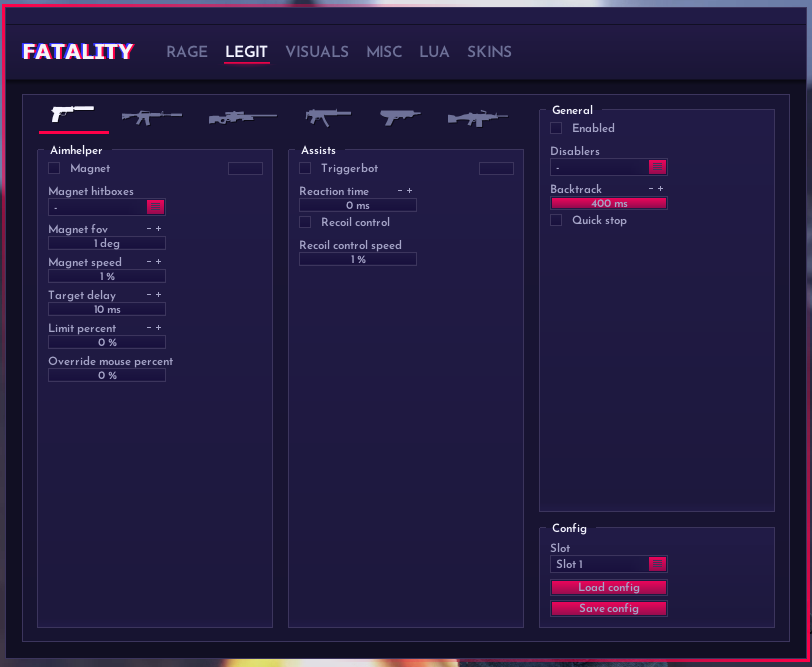
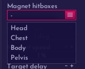

# Legit - 合法

<figure><figcaption>
Legit
</figcaption></figure>

## Main: 主设置

### Magnet: 启用合法自瞄

需要启用General的Enabled才有效

### Magnet hitboxes: 锁定部位

选择合法自瞄需要锁定的部位

<figure><figcaption>
hitboxes
</figcaption></figure>

Head: 头部  Chest: 胸部  Body: 身体周围  Pelvis:骨盆

### Magnet fov: 自瞄范围

### Magnet speed: 自瞄顺滑度

### Target delay: 延迟锁定

### Limit percent: 限制百分比

### Override mouse percent: 覆盖鼠标百分比

## Assists: 协助

### Triggerbot: 自动扳机

启用后，机器人会帮你自动开枪

### Reaction time: 反应时间

锁定后将会有一段等待时间，等待时间之后才会自动扳机。取决于你的设置（单位:ms 毫秒）

### Recoil Control: 弹道控制

后座补偿
