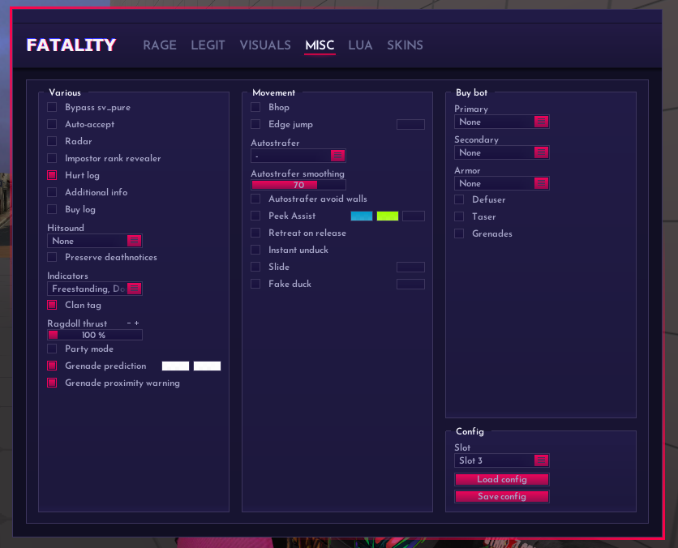

# Misc - 杂项

<figure><figcaption>
Misc
</figcaption></figure>

## Various: 普通设置

### Bypass sv\_pure: 绕过服务器文件检查

绕过服务器对本地文件的检查，如果否则会被踢出

### Auto-accept: 自动接受

在竞技匹配上自动接受比赛

### Radar: 雷达透视

### Impostor rank revealer: 显示段位

### Hurt log: 击中日志

### Additional info: 高级日志


miss shot due to spread是强制使用的


### Buy log: 输出在局所有玩家的购买日志

### Hitsound: 击中音效

### Preserve deathnotices: 击杀保留

### Indicators: 指示器

选中后将会在左侧显示

<figure><figcaption>
Indicators
</figcaption></figure>

| 翻译           | 作用 & 注释                                | FLAG            |
| ------------ | -------------------------------------- | --------------- |
| 手动AA指示器      | 显示手动aa的状态（不与FS共存）                      | LEFT/BACK/RIGHT |
| 自动藏头指示器      | 显示自动藏头的状态（不手动AA共存）                     | FS              |
| 延迟补偿指示器      | 显示延迟补偿                                 | LC              |
| 一枪双射         | 显示DT/充能状态                              | DT以及充能条         |
| Hide shot    | 显示不抬头的状态                               | HS              |
| 伤害覆盖值        | 显示伤害的覆盖值                               | \*数字\*          |
| 强制安全点指示器     | 显示强制安全点的状态                             | SAFE            |
| 强制Baim指示器    | 显示强制打身体的状态                             | BODY            |
| 仅打头          | 显示仅打头的状态 (在一些特殊服务器上e.g:爆头服则是会一直显示此指示器) | HSO             |
| \*隐藏\* 假蹲指示器 | 显示假蹲状态 (在一些特殊服务器上e.g: 干拉服 则是会显示NO FD)  | FD或NO FD        |

### Clan tag: Fatality组名

无法在官匹上使用（目前是正版有这个问题）

### Ragdoll thrust: 布娃娃速率

不好描述，过于抽象，请自行测试

### Party mode: 派对模式

启用电击枪喝彩效果

### Grenade prediction: 手雷预测

### Grenade prediction: 手雷警告

## Movement: 移动辅助

### Bhop: 连跳

### Edge jump: 边缘跳

启用后将检测人物位置是否处于边缘，如果是则自动跳跃

### Autostrafer: 自动转向

<figure><figcaption>
Autostrafer
</figcaption></figure>

Viewangles: 根据视角自动转向加速

Movement keys: 移动键强制转向

Easy strafe: 轻松转向(?)

On jump release: 当跳跃键松开时

### Autostrafer smoothing: 自动转向顺滑度

### Peek Assist: 自动Peek

### Retreat on release: 当松开按键后回去

配合Peek Assist使用

### Instant unduck: 无限蹲

### Slide: 慢走

### Fake duck: 假蹲

在一些服务器上无法使用FD

## Buybot: 自动购买机器人

### Primary: 主武器

### Secondary: 副武器

### Armor: 护甲

### Defuser: 拆弹器

### Taser: 电击枪

### Grenades: 道具
