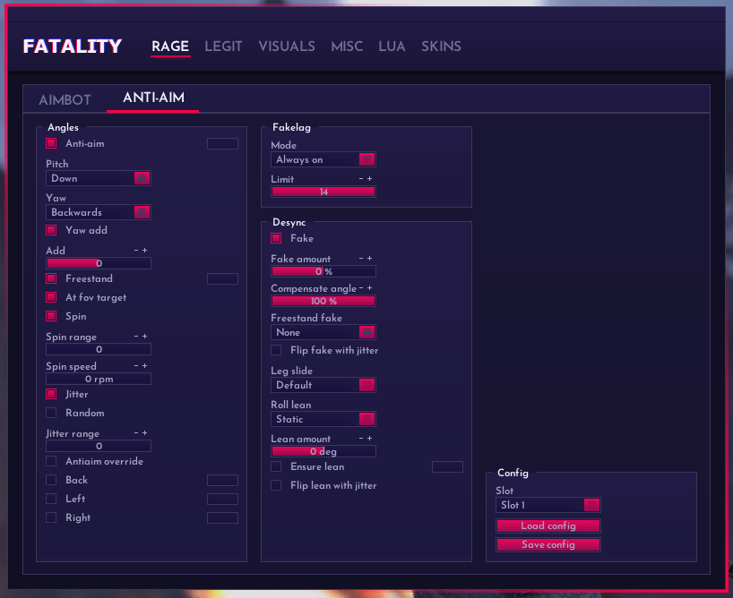
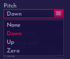
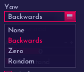

# ANTI-AIM - 反自瞄

<figure><figcaption>
ANTI-AIM
</figcaption></figure>

## Angles: 角度设置

### Anti-Aim: 启动反自瞄

全局反自瞄开关

### Pitch: 头部俯仰

<figure><figcaption>
Pitch
</figcaption></figure>

锁定头部俯仰

None: 不锁定

Down: 低头

Up: 抬头

Zero: 平视

### Yaw: 身体方向偏航

预设控制身体的偏航

<figure><figcaption>
Yaw
</figcaption></figure>

None: 无

Backwards: 背身

Zero: 锁0°偏航

Random: 随机偏航

### Yaw add: 自定义偏航角

在yaw预设的上额外加上偏航角度

### Freestanding: 自动藏头

启用后，作弊将根据地图建筑自动改变身体偏航达成自动藏头

### At fov target: 根据目标改变偏航

根据威胁程度或目标距离改变身体偏航

### Spin: 旋转

Spin range: 旋转范围

Spin speed: 旋转速度 (单位rpm)

### Jitter: 抖动

Random: 随机抖动

Jitter range: 抖动范围

### Antiaim override: 手动藏头

## Fakelag: 假卡

### Mode: 假卡模式

<figure><figcaption>
FL Mode
</figcaption></figure>

禁用或启用假卡

None: 禁用

Always on: 一直启用

Adaptive: 自适应

### Limit: 限制最大Choke值

又叫最大假卡值

## Desync: 不同步（假身）

### Fake: 启用假身

### Fake amount: 假身偏航

控制假身的左右偏航

### Compensate angle: 角度补偿

仅在Fake amount为负的时候有效，额外添加正偏航达到身体偏航为0度

### Freestanding fake: 自动假身

自动改变假身的方向

<figure><figcaption>
freestanding fake
</figcaption></figure>

None: 禁用

Normal: 默认模式

Opposite: 分离模式

### Flip fake with jitter: 假身抖动

不断的改变假身的左右方向

### Leg slide: 腿部运动

改变腿部运动

<figure><figcaption>
Leg slide
</figcaption></figure>

Default: 默认

Never slide: 禁用滑步

Always slide: 一直滑步

### Roll lean: 倾斜

预设roll设置

<figure><figcaption>
roll lean
</figcaption></figure>

None: 禁用倾斜

Static: 固定角度

Extend fake: 扩展角度（带Pitch）

Invert fake: 反转假身

Freestand: 自动假身

Freestand opposite: FS+分离角度

Jitter: 抖动假身

### Ensure lean: 确保倾斜

启用后将限制行走速度，保持倾斜分离
