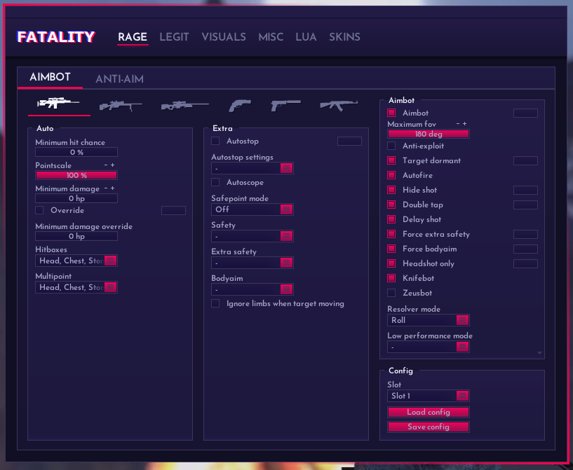
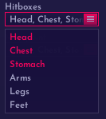
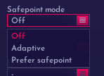
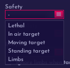

# AIMBOT - 自瞄机器人

<figure><figcaption>
AIMBOT
</figcaption></figure>

### 武器库:

从左到右分别为:

Auto: 连狙  Scout: 鸟狙  AWP: 大狙  Heavy Pistols: 重型手枪（R8/沙鹰） Pistols: 手枪  Rifle: 步枪

## Main: 主要设置

### Minimum hit chance: 最低命中率


这是**最低**，而不是固定


### Pointscale: 部位扫描

类似于多点


拉低 = 牺牲准确率而获得更快的开枪速度

拉高 = 牺牲开枪速度而获得更高的准确率


### Minimum damage: 最低伤害

### Override/Minimum damage override: 伤害覆盖

Override 选中后，Mindmg的设置将变更到Minimum damage override的值

### Hitboxes: 命中部位

### Multipoint: 多点部位

<figure><figcaption>
hitgroups
</figcaption></figure>

Head: 头部  Chest: 胸部  Stomach: 肚子  Arms: 手臂  Legs: 腿部  Feet: 脚

Neck: 脖子 （For fac用户）


fac是附加部位，Head Chest和Stomach默认启用


## Extra: 额外设置

### Auto stop: 自动急停

<figure><figcaption>
Auto stop mode
</figcaption></figure>

可多选:

Between shots: 在射击后急停

Early: 提前/预判急停

Only when lethal:  仅在致命的情况下急停


与OT的Lethal Only一样，并且双枪或者其他手枪启用后会无法开枪


### Autoscope: 自动开镜

### Safepoint mode: 安全点设置

<figure><figcaption>
Safepoint mode
</figcaption></figure>

Off: 禁用安全点

Adaptive: 自适应安全点

Prefer safepoint: 优先安全点

### Safety: 在xxx情况下启用安全点

### Extra safety: 在额外情况下使用安全点

### Bodyaim: 在xx情况下Baim

<figure><figcaption>
safety
</figcaption></figure>

Lethal: 当致命时启用安全点 （防止致命一枪空了）

In air target: 当目标在天上

Moving target: 当目标在移动

Standing target: 当目标站立不动

Limbs: 强制双臂安全点

### Ignore limbs when target moving: 忽略双臂当目标在移动中

### Jumpscout: 跳狙 (仅在Scout设置页)

允许你在启用Autostrafer下原地跳起（仅在使用鸟狙的情况下）

### Autorevolver: 自动r8预热 (仅在Heavy Pistols设置页)

自动预热左轮以获得更快的开枪速度

## Aimbot: 自瞄机器人设置

### Aimbot: 启用自瞄

### Maximum fov: 自瞄范围

### Anti-exploit: 反防御


此功能不适用在Link服务器以及其他爆头服或者鸟狙服

原理就是关闭延迟补偿，而可以直架DT PEEK敌人

启用后会对**ragebot的性能造成一定的衰弱**和**禁用回溯**


### Target dormant: 休眠机器人

当敌人的ESP处于休眠状态，aimbot会计算敌人的位置并进行盲打


Better than Neverlose.cc


### Autofire: 自动开枪

### Hide shot: 不抬头射击


此漏洞会影响AA和aimbot的射击速度，请谨慎使用


### Double tap: 一枪双射

### Force extra safety: 强制安全点

忽略条件强制启用安全点部位

### Force bodyaim: 强制baim

忽略条件强制打身子

### Headshot only: 仅打头

不打其他部位仅打头


新版的里Fatality加入了服务器cvar的检测

当检测到服务器规则仅有打头才有伤害时，HSO会自动强制启用


### Knifebot: 自动刀

### Zeusbot: 自动电击枪

还有自动电击枪的命中率

### Resolver mode: 解析模式:

<figure><figcaption>
Resolver mode
</figcaption></figure>

不同的解析模式会有不同的效果，如在HvH上禁用roll解析效果可能会更好

Roll: 启用Roll解析

Roll disabled: 禁用Roll解析

### Low performance mode: 低帧数优化

<figure><figcaption>
Low performance mode
</figcaption></figure>

Limit targets: 限制自瞄/解析目标数目

Limit scan accuracy: 限制准确率扫描力度

Limit targets: 限制自瞄/解析目标数目
