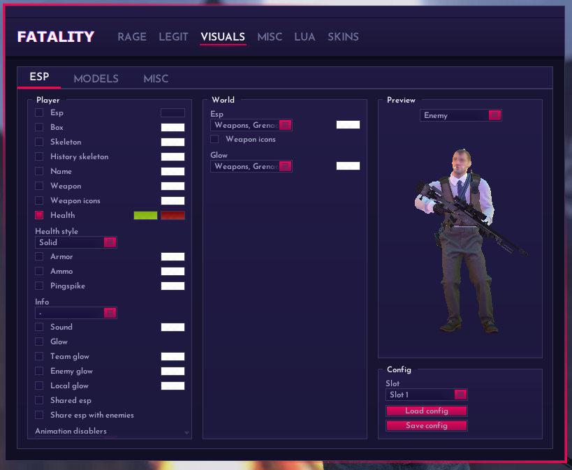

# ESP - 透视

<figure><figcaption>
ESP
</figcaption></figure>

## Player: 人物设置

### Esp: 启用透视

### Box: 方框

### Skeleton: 骨骼

### History skeleton: 回溯骨骼

### Name: 名字

### Weapon: 武器名字

### &#x20;Weapon icons: 武器图标

### Health: 血条

### Health style: 血条颜色模式

Solid: 根据血量改变颜色

Gradient: 渐变

### Armor: 护甲值

### Ammo: 弹药数

### Pingspike: 延迟

### Info: 信息

<figure><figcaption></figcaption></figure>

| Info       | 翻译    | 作用                              |
| ---------- | ----- | ------------------------------- |
| Money      | 金钱    | 显示金钱数                           |
| Armor      | 护甲    | 显示护甲                            |
| Hittable   | 可命中   | 当Aimbot可以击中此人会显示这个              |
| Defuser    | 拆弹器   | 显示此人拥有拆弹器                       |
| Taser      | 电击枪   | 显示此人拥有电击枪                       |
| Bomb       | 炸弹    | 显示此人携带C4                        |
| Scoped     | 开镜    | 显示敌人的开镜状态                       |
| LC         | 延迟补偿  | 显示此人是否处于延迟补偿的状态                 |
| Fake duck  | 假蹲    | 显示此人是否正在假蹲                      |
| Exploiting | 利用漏洞中 | 显示此人是否在使用Hide Shots或者Double Tap |

### Sound: 脚步声纳

### Glow: 人物发光

Enemy: 敌人发光

Team: 队友发光

Local: 自己发光

### Shared esp: 共享ESP&#x20;


仅在局中与使用fa的玩家共享


### Share esp with enemies: 与敌人共享ESP

### Animation disabler: 禁用动画

<figure><figcaption>
anim disabler
</figcaption></figure>

Dormant: 禁用休眠动画

Model fade in/out: 禁用模型渐变

ESP fade in/out: 禁用ESP显示渐变

Healthbar: 禁用血条动画

Thirdperson: 禁用第三人称镜头动画

## World: 世界ESP

### ESP: 额外ESP

<figure><figcaption>
ESP
</figcaption></figure>

Weapons: 武器透视

Grenades: 手雷/道具透视

C4: 炸弹透视

Danger-Zone: 头号特训透视
