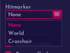

# Misc - 视觉杂项

<figure><figcaption>
Misc
</figcaption></figure>

## Local: 本地设置

### Thirdperson: 第三人称

### Force when dead: 死亡时强制第三人称

### Disbale on grenade: 手拿道具时禁用第三人称

### Distance: 第三人称距离

### Transparency in scope: 开镜下的模型透明度

### Fov changer: FOV更改

启用后会改变你的视角

### Remove zoom: 移除开镜放大

### Viewmodel fov changer: 手臂FOV更改

启用后会更改你的手臂FOV

### Aspect ratio: 屏幕拉伸

### Goblin mode: 矮人模式

矮人科技

### Remove visual punch: 移除视角后座感

### Remove scope: 开镜模式

<figure><figcaption>
Remove scope
</figcaption></figure>

Off: 不改变

Static: 固定

Dynamic: 动态

Gradient static: 渐变固定准星

Gradient dynamic: 渐变动态准星

### Penetration crosshair: 墙体穿透准星

### Force crosshair: 强制准星

强制显示准星

### Spread circle: 扩散可视化

显示扩散范围

<figure><figcaption>
Spread circle
</figcaption></figure>

Off: 禁用

Gradient: 渐变

Rainbow: Fatality经典彩色

Rainbow: 经典彩色 + 滚动

## Various: 各样的

### Darkmode: 黑暗模式

第一个颜色框的作用未知，第二个颜色框是世界上色

Darkmode amount: 黑暗度


fatality强制世界暗黑，即便是空白参数


### Prop Transparency：装饰透明度

改变地图上的装饰透明度


不能用在一些弱智地图上，因为那些地图都是世界地图而非Prop


### Skybox: 自定义天空盒

不能使用本地文件

### Disable post-processing: 禁用后期处理

### Hitmark: 击中标记

<figure><figcaption>
Hitmarker
</figcaption></figure>

None: 禁用击中标记

World: 在敌人上显示标记

Crosshair: 在准星上显示标记

### Show Impacts: 显示子弹点

第一个为服务器子弹穿点，第二个为本地子弹穿点

### Remove blur: 移除模糊效果

### Remove smoke: 移除烟雾

### Remove flash: 移除闪光效果

### OOF arrows: 敌人指示器

Distance: 离准星的距离

Size: 指针大小

## Beams: 子弹射线

### Enabled: 启用射线显示

### Width: 射线宽度

### Team/Enemy/Local: 显示队友的/敌人的/自己的子弹射线
