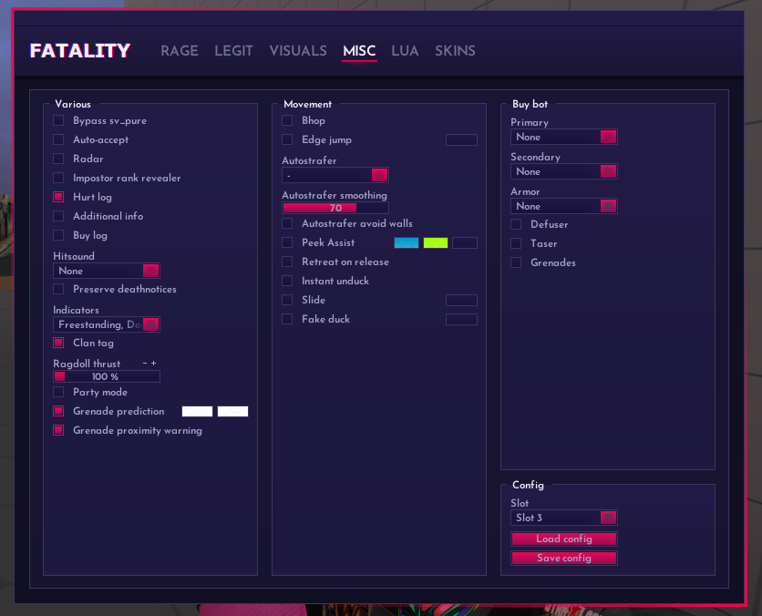

# Misc - 视觉杂项

<figure><figcaption>
Misc
</figcaption></figure>

## Local: 本地设置

### Thirdperson: 第三人称

### Force when dead: 死亡时强制第三人称

### Disbale on grenade: 手拿道具时禁用第三人称

### Distance: 第三人称距离

### Transparency in scope: 开镜下的模型透明度

### Fov changer: FOV更改

启用后会改变你的视角

### Remove zoom: 移除开镜放大

### Viewmodel fov changer: 手臂FOV更改

启用后会更改你的手臂FOV

### Aspect ratio: 屏幕拉伸

### Goblin mode: 矮人模式

矮人科技

### Remove visual punch: 移除视角后座感

### Remove scope: 开镜模式

<figure><figcaption>
Remove scope
</figcaption></figure>

Off: 不改变

Static: 固定

Dynamic: 动态

Gradient static: 渐变固定准星

Gradient dynamic: 渐变动态准星

### Penetration crosshair: 墙体穿透准星

### Force crosshair: 强制准星

强制显示准星

### Spread circle: 扩散可视化

显示扩散范围

<figure><figcaption>
Spread circle
</figcaption></figure>

Off: 禁用

Gradient: 渐变

Rainbow: Fatality经典彩色

Rainbow: 经典彩色 + 滚动
