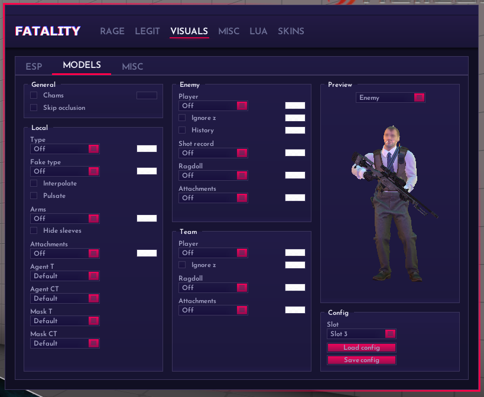

# MODELS - 模型上色

<figure><figcaption>
Models
</figcaption></figure>

## Type: 上色模式

<figure><figcaption>
Type
</figcaption></figure>

Off: 无上色

Normal: 模型上色

Flat: 平坦上色

Rim Glow: 边缘过度发光

Contour: 轮廓上色

Flow: 流动上色

Acrylic: Nomral的发白版

Legacy: 普通发光上色

## General: 一般

### Chams: 启用上色

### Skip occlusion: 不渲染遮挡体

## Local: 本地模型设置

### Type: 本地上色模式

### Fake type: 假身上色模式

### Interpolate: 顺滑

忽略Fakelag的假身上色

### Pulsate: 搏动

### Arms: 手臂上色

### Hide sleeves: 隐藏袖子

### Attachments: 其他附件上色

### Agent: 探员修改

### Mask: 面具修改

## Enemy: 敌人模型设置

### Player: 敌人模型上色

### Ignore Z: 墙上上色

### Shot record: 击中记录模型

### 其他同理...

